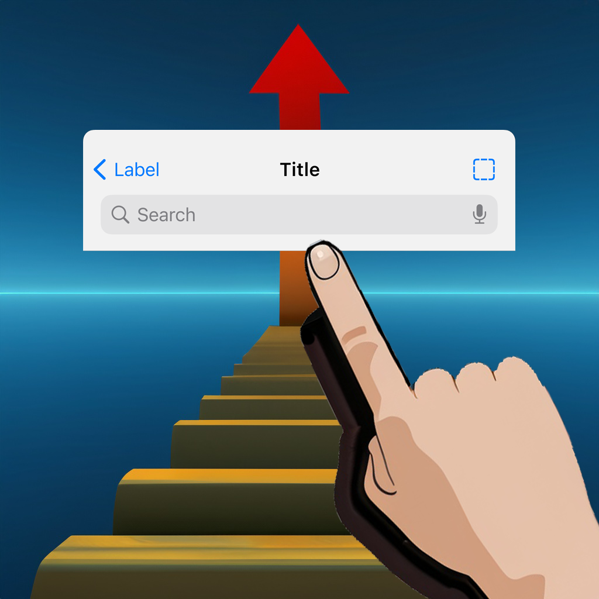

# SwipeToHideNavBar
How to hide the native SwiftUI navigation bar when scrolled.

|  |  |
|---|---|

## Introduction

All demos in this repo were written by SwiftUI. The only purpose of this repo I created is just for learning SwiftUI and comminications. All of Business incomes and Copyrights belong to Kavsoft at [Home | Kavsoft](https://kavsoft.dev).

## Reference
 [Hide Navigation Bar On Swipe - iOS 17 - Xcode 15 | YouTube](https://youtu.be/_oFMZaXIgPc?si=ZPcJCE5Bjnogfk40)

## My Development Environment
* Xcode 15.0
* Swift 5.9
* iOS 17.0
* macOS 13.6 Ventura

